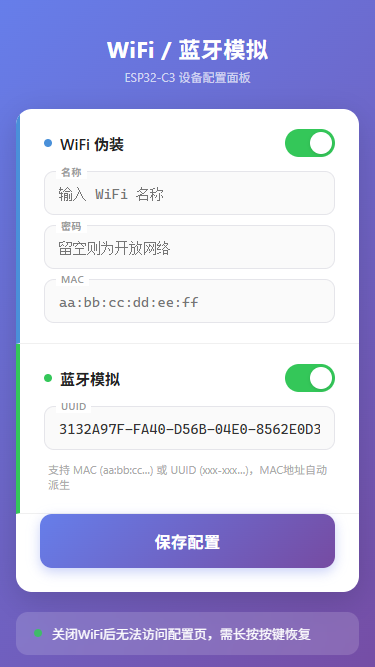

# WiFi / 蓝牙设备模拟

基于 **ESP32-C3** 芯片，通过修改 AP 模式 WiFi MAC + 模拟 BLE Service UUID 广播，实现 WiFi 与蓝牙设备模拟。

## 硬件要求

| 项目 | 说明 |
|------|------|
| 主控 | Seeed Studio **XIAO ESP32C3**（推荐） |
| 指示灯 | GPIO 8 — WiFi 状态 / BLE 启动闪烁 |
| 按钮 | BOOT(GPIO 9) — 长按清除配置 / RST — 重启 |
| 供电 | USB Type-C 5V |

---

## 烧录

### 1. 板型选择

编辑 `platformio.ini`：

```ini
board = seeed_xiao_esp32c3    ; XIAO ESP32C3
; board = esp32-c3-devkitm-1  ; 其他 C3 开发板
```

### 2. VS Code + PlatformIO

| 步骤 | 操作 |
|------|------|
| 编译 | 底部状态栏 → ✅ Build |
| 烧录固件 | → Upload |
| 上传网页 | PlatformIO 面板 → Upload Filesystem Image |

### 3. 命令行

```bash
pio run --target upload       # 烧录固件
pio run --target uploadfs     # 上传网页文件
pio device monitor            # 查看串口日志
```

> 💡 烧录失败时：按住 BOOT → 按一下 RST → 松开 BOOT → 重新 Upload

---

## 配置页面

烧录完成后：

1. 手机搜索并连接热点 **`WIFI MANAGER`**（开放，无需密码）
2. 浏览器访问 **`192.168.4.1`** 打开配置页
3. 修改 WiFi / 蓝牙参数后点击 **保存配置**，设备自动重启生效

> 网页文件通过 LittleFS 存放在 `data/` 目录，每次修改后需 `pio run --target uploadfs`

---

## 功能

### 📶 WiFi 伪装

| 字段 | 说明 |
|------|------|
| WiFi 名称 | 1-32 字符 |
| WiFi 密码 | ≥8 字符或留空（开放网络） |
| MAC 地址 | `aa:bb:cc:dd:ee:ff` |

- 关闭 WiFi 开关后**完全不发射信号**，仅蓝牙运行
- 发射功率已优化至 ~1dBm，覆盖 2 米，基本不发热

### 📡 蓝牙模拟

| 字段 | 说明 |
|------|------|
| UUID | MAC 地址 或 128-bit UUID 格式 |

- 蓝牙默认开启，广播名 **`PunchDevice`**
- 只需填写一个 UUID，MAC 地址自动派生
- 采用 128-bit Service UUID 广播方式，MAC 地址自动从 UUID 派生



### 独立开关

| WiFi | BLE | 效果 |
|:----:|:---:|------|
| ✅ | ✅ | WiFi + 蓝牙同时运行 |
| ✅ | ❌ | 仅 WiFi |
| ❌ | ✅ | 仅蓝牙（WiFi 完全不发射） |
| ❌ | ❌ | 全部关闭 |

---

## 按键

| 按钮 | 操作 | 功能 |
|------|------|------|
| BOOT | 长按 >1 秒 | 清除所有配置，恢复出厂 |
| RST | 按一下 | 重启（配置不变） |

---

## LED 指示灯

| 状态 | 含义 |
|------|------|
| 常亮 | WiFi AP 创建成功 |
| 快闪 2 次 | BLE 广播启动成功 |
| 熄灭 | WiFi 关闭 / 默认模式 |

---

## 技术细节

| 特性 | 实现 |
|------|------|
| WiFi MAC 伪装 | `esp_wifi_set_mac(WIFI_IF_AP, ...)` |
| BLE 广播 | `BLEDevice::setCompleteServices(128-bit UUID)` |
| BLE MAC 派生 | 从 UUID 前 12 位 hex 自动生成 |
| 发射功率 | `esp_wifi_set_max_tx_power(4)` ≈ 1dBm |
| Beacon 间隔 | 500ms（默认 100ms，降低射频占空比） |
| 存储 | Preferences (NVS)，断电不丢失 |
| 文件系统 | LittleFS 存放网页 |
| 版本检测 | `FIRMWARE_VER` 变更自动清 NVS，防止旧配置异常 |

---

## 鸣谢

- [Starryccc/DingDing_WiFi](https://github.com/Starryccc/DingDing_WiFi) — 原始 WiFi 模拟项目
- [Seeed Studio XIAO ESP32C3](https://wiki.seeedstudio.com/cn/XIAO_ESP32C3_Bluetooth_Usage/)

## 许可与免责声明

本项目仅限个人用户在合法范围内自用。源代码以学习研究为目的开放，**禁止任何形式的商业使用**，包括但不限于代安装、代部署、售卖、付费提供下载链接及其他一切营利行为。

对源代码的任何引用（无论数量多少）均须进行署名。基于本项目衍生的作品**必须同样以开源方式发布**。

使用者因使用本项目所产生的一切后果由使用者自行承担，与作者无关。
